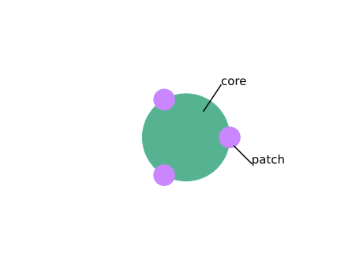
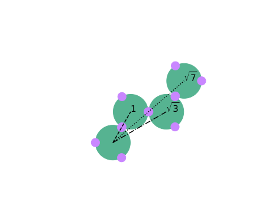

# Patchy Particles MD simulations

## Overview
This software suite simulates the dynamics of patchy particle systems. Cores of particles interact through excluded volume interactions while patches attract each other and can intersect. 

 

## Repository Structure
- `/progs`: Contains the core scripts
  - `initialisation.py`: Script to initialize the simulation setup.
  - `actions.py`: Conducts the simulations with predefined parameters.
  - `analysis.py`: Analyzes simulation results and computes various properties.
  - `drawing.py`: Utility to sketch representations of patchy particles.
- `/scripts`: Contains scripts to run various simulations.
  - `run_sim.py`: Main script to execute different simulation scenarios.
- `/notebooks`: Jupyter notebooks for detailed data analysis and visualization.
  - Includes notebooks for analyzing bonds, structure, mobility, and phase diagrams.

